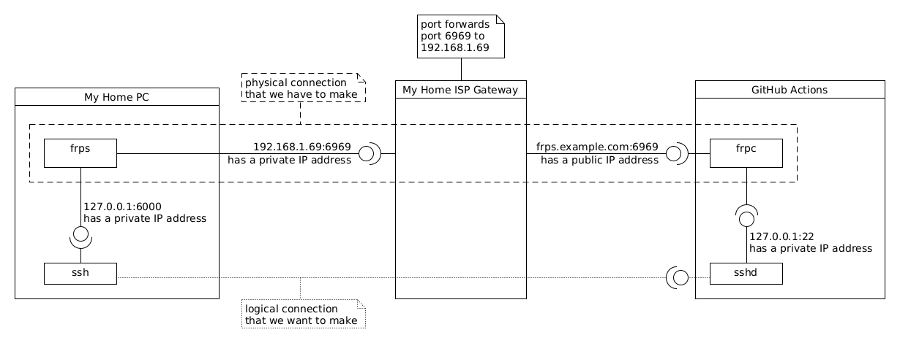

# About

This opens a reverse-shell in a GitHub Actions job to aid you troublshooting odd behaviours.

Since GitHub Actions cannot be directly accessed from the internet (only outbound connections are allowed), we need a way to expose individual services to our local machine. For this we are going to use the [fatedier/frp](https://github.com/fatedier/frp) reverse proxy and our local machine that is indirectly accessible from the internet. Something alike:



## Usage

Generate the TLS certificates:

```bash
export FRPS_DOMAIN=frps.example.com
./generate-certificates.sh
```

Start the server with the [corresponding frps.ini configuration file](frps.ini):

```bash
./frp/frps -c ./frps.ini
```

Temporarily run the client in our machine to test everything with the [corresponding frpc.ini configuration file](frpc.ini):

```bash
./frp/frpc -c ./frpc.ini
```

Connect to the client ssh server:

```bash
ssh -o Port=6000 127.0.0.1
```

Stop the `frpc` client.

You are now almost ready to run `frpc` inside your GitHub Action job; before doing that, you need to create the following [repository encrypted secrets](https://docs.github.com/en/free-pro-team@latest/actions/reference/encrypted-secrets):

| Secret Name | Value |
|-------------|-------|
| `FRPS_DOMAIN` | your frps domain |
| `FRPC_TLS_KEY` | paste the contents of the `ca/github-key.pem` file |
| `FRPC_TLS_CERTIFICATE` | paste the contents of the `ca/github.pem` file |
| `FRPC_TLS_CA_CERTIFICATE` | paste the contents of the `ca/ca.pem` file |
| `SSH_PUBLIC_KEY` | paste the contents of the `~/.ssh/id_rsa.pub` file |

You can now run the GitHub Action.

**NB** `frpc` will keep the Action running until GitHub expires it after 6h (as per the [usage limits](https://docs.github.com/en/free-pro-team@latest/actions/reference/usage-limits-billing-and-administration#usage-limits)) or you cancel it.

Connect to the GitHub Action ssh server:

```bash
ssh -o Port=6000 runner@127.0.0.1
#killall frpc # terminate frpc from the shell.
```

And that's it... You now have a way to troubleshoot your GitHub Actions.

For more details see [this repository action workflows](.github/workflows/).

## Alternatives

* [Chisel](https://github.com/jpillora/chisel)
